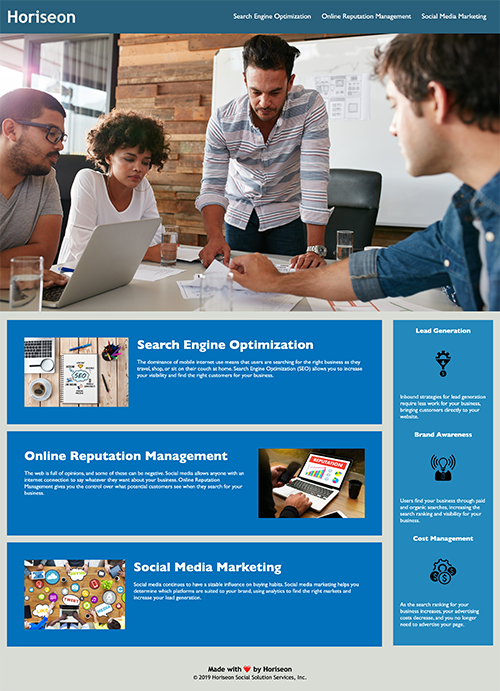

For this project, I was given a single web page by a marketing agency that consisted of HTML and CSS. They wanted to improve the code so it followed accessibility standards and therefore ranked better in search engines.

After viewing the source code, I decided to make the following changes:
* Updated the title tag to something relevant and that would give Google an indication of what the webpage was about.
* Changed divs to sections where applicable. This was on anything that had meaning and context.
* Added an id to the SEO section of the website, so I could link the nav option to the correct place.
* Added alt text to images and links.
* To follow a correct and logical heading structure, I changed the h2 in the footer to a h4.
* Added comments to both the HTML and CSS file to give more clarity on the different parts of the code and to make it clear which sections are which.
* Repositioned the CSS slightly so it follows the same order as the HTML. This involved moving the content section above the benefits section.

## Deployed page screenshot

## Deployed page
[This is a link to the deployed application](https://mattglwilliams.github.io/code-refractor-repo/)